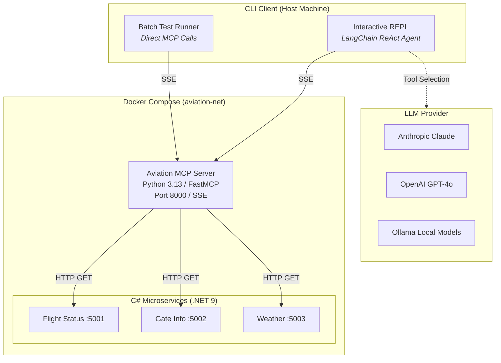
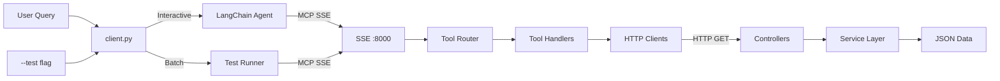
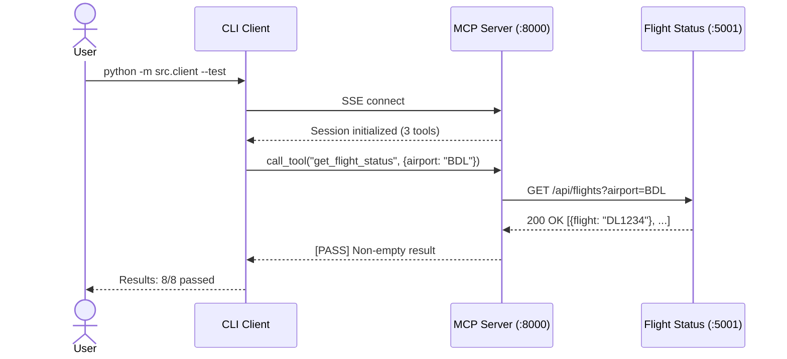

# Aviation MCP Diagrams

Mermaid source files (`.mmd`) and rendered PNGs for project documentation.

## Rendering

To regenerate PNGs from the Mermaid source files:

```bash
mmdc -i docs/pics/architecture.mmd -o docs/pics/architecture.png -b white -s 2
mmdc -i docs/pics/flow.mmd -o docs/pics/flow.png -b white -s 2
mmdc -i docs/pics/sequence.mmd -o docs/pics/sequence.png -b white -s 2
```

Requires [mermaid-cli](https://github.com/mermaid-js/mermaid-cli): `npm install -g @mermaid-js/mermaid-cli`

## Architecture Diagram

Shows the full system layout: CLI client, LLM providers, MCP server, C# microservices, and JSON stub data stores.



## Flow Diagram

Shows the request processing pipeline from user input through all layers to response output.



## Sequence Diagram

Shows the startup, batch test, and interactive mode request lifecycles with exact API calls.


